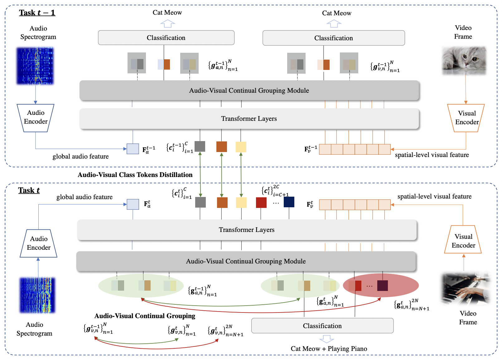

# [ICCV-2023] Class-Incremental Grouping Network for Continual Audio-Visual Learning

CIGN is a novel framework can directly learn category-wise semantic features to achieve continual audio-
visual learning.


<div align="center">
  
</div>


## Environment

To setup the environment, please simply run

```
pip install -r requirements.txt
```

## Datasets

###  VGG-Instruments

Data can be downloaded from [Mix and Localize: Localizing Sound Sources in Mixtures](https://github.com/hxixixh/mix-and-localize)

###  VGG-Sound Source

Data can be downloaded from [Localizing Visual Sounds the Hard Way](https://github.com/hche11/Localizing-Visual-Sounds-the-Hard-Way)


## Train

For training the CIGN model, please run

```
python train_avctl.py --multiprocessing_distributed \
    --port 12345 \
    --train_data_path /path/to/datasets/vgginstruments/train/ \
    --test_data_path /path/to/datasets/vgginstruments/train/ \
    --experiment_name_pre vgginstruments_g0_baseline_e20 \
    --experiment_name vgginstruments_g1_baseline_e20_v3_true \
    --resume_av_token \
    --train_stage 1 --test_stage 1 \
    --model 'avctl' \
    --trainset 'vgginstruments_group_0,vgginstruments_group_1' --num_class 18 \
    --testset 'vgginstruments_group_0,vgginstruments_group_1' \
    --epochs 20 \
    --batch_size 128 \
    --init_lr 0.0001 \
    --attn_assign hard \
    --dim 512 \
    --depth_aud 3 \
    --depth_vis 3
```

## Test

For testing and visualization, simply run

```
python test.py --test_data_path /path/to/vgginstruments/ \
    --test_gt_path /path/to/vgginstruments/anno/ \
    --model_dir checkpoints \
    --experiment_name vgginstruments_cign \
    --model 'avgn' \
    --testset 'vgginstruments_group_0,vgginstruments_group_1' \
    --attn_assign soft \
    --dim 512 \
    --depth_aud 3 \
    --depth_vis 3
```


## Citation

If you find this repository useful, please cite our paper:
```
@inproceedings{mo2023class,
  title={Class-Incremental Grouping Network for Continual Audio-Visual Learning},
  author={Mo, Shentong and Pian, Weiguo and Tian, Yapeng},
  booktitle={Proceedings of the IEEE/CVF International Conference on Computer Vision},
  year={2023}
}
```
